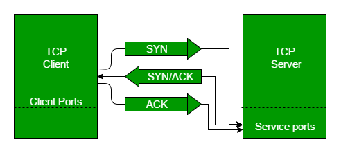

# Transmission Control Protocol (TCP)

The Transmission Control Protocol (TCP) is one of the fundamental protocols of the Internet protocol suite, often referred to as TCP/IP. Originating from the initial network implementations, TCP complements the Internet Protocol (IP), working together to facilitate reliable data transmission across IP networks. TCP ensures the reliable, ordered, and error-checked delivery of a stream of bytes (octets) between applications on hosts communicating via an IP network. Major Internet applications, such as the World Wide Web, email, remote administration, and file transfer, rely on TCP, which operates at the Transport layer of the TCP/IP suite. Additionally, secure communication protocols like SSL/TLS typically run on top of TCP.

TCP is connection-oriented, meaning that the sender and receiver must establish a connection with agreed parameters before any data can be exchanged. This connection setup is accomplished through a process known as the [three-way handshake](./3-Way-Handshake.md). In this procedure, the server must be in a listening state (passive open) to accept connection requests from clients. The three-way handshake involves three steps: the client sends a synchronization (SYN) packet, the server responds with a synchronization-acknowledgment (SYN-ACK) packet, and finally, the client sends an acknowledgment (ACK) packet, establishing a connection (active open). While this handshake, along with retransmission and error detection mechanisms, enhances reliability, it also increases latency.

For applications where time is more critical than reliability, the User Datagram Protocol (UDP) is used instead, offering a connectionless datagram service.

TCP employs network congestion avoidance techniques to maintain the flow of data across the network efficiently. However, TCP is not without vulnerabilities, including denial of service attacks, connection hijacking, TCP veto, and reset attacks.

### Real-World Example:

Consider an online shopping website where users can browse products, add items to their cart, and make purchases. When a user clicks to view a product, their computer (the client) initiates a TCP connection with the website's server. Through the three-way handshake, the client and server establish a reliable connection. This ensures that the user's request to view the product details is received correctly and that the product information sent back to the user is complete and accurate. If any part of the data is lost during transmission, TCP's error-checking and retransmission mechanisms will ensure it is resent, so the user sees the correct product details.

In contrast, a live video streaming service might use UDP instead of TCP. While watching a live stream, slight data losses (such as a few frames) might be acceptable and less noticeable compared to the delays that would result from retransmitting lost data. Thus, the service prioritizes timely delivery over reliability to provide a smooth viewing experience.

## Historical Origin

In May 1974, Vint Cerf and Bob Kahn described an internetworking protocol designed to share resources using [packet switching](../1.Please_Read./What%20is%20Packet%20Switching.md) among network nodes. This pioneering work incorporated concepts from the French CYCLADES project, thanks to their collaboration with Gérard Le Lann. The resulting protocol specification, known as RFC 675 (Specification of Internet Transmission Control Program), was written by Vint Cerf, Yogen Dalal, and Carl Sunshine, and published in December 1974. Notably, this document contains the first known use of the term "internet" as a shorthand for "internetwork."

The original Transmission Control Program integrated both connection-oriented links and datagram services between hosts. However, in its fourth version, this monolithic protocol was divided into two distinct components: the Transmission Control Protocol (TCP) and the Internet Protocol (IP). This division led to the development of a modular architecture that informally became known as TCP/IP. Formally, it was referred to as the DoD internet architecture model (or simply the DoD model) and the DARPA model. Over time, TCP/IP became synonymous with the Internet Protocol Suite.

Several Internet Experiment Note (IEN) documents trace the evolution of TCP into its modern form:

- IEN 5: Specification of Internet Transmission Control Program TCP Version 2 (March 1977)
- IEN 21: Specification of Internetwork Transmission Control Program TCP Version 3 (January 1978)
- IEN 27
- IEN 40
- IEN 44
- IEN 55
- IEN 81
- IEN 112
- IEN 124

TCP was officially standardized in January 1980 as RFC 761.

In recognition of their foundational work on TCP/IP, Vint Cerf and Bob Kahn received the prestigious Turing Award in 2004.

## Network Function

The Transmission Control Protocol (TCP) provides a critical communication service that operates at an intermediate level between an application program and the Internet Protocol (IP). Specifically, TCP offers host-to-host connectivity at the transport layer of the Internet model. Applications using TCP do not need to handle the specifics of data transmission, such as IP fragmentation required to match the maximum transmission unit (MTU) of the underlying transmission medium. At the transport layer, TCP manages all the handshaking and transmission details, presenting a simplified abstraction of the network connection to the application, typically through a network socket interface.

At the lower levels of the protocol stack, IP packets may be lost, duplicated, or delivered out of order due to network congestion, traffic load balancing, or unpredictable network behavior. TCP addresses these issues by detecting problems, requesting the retransmission of lost data, rearranging out-of-order data, and helping to minimize network congestion to reduce the occurrence of these problems. If data delivery ultimately fails, TCP notifies the source of this failure. Once the TCP receiver reassembles the sequence of bytes (octets) originally transmitted, it passes them to the receiving application, thus abstracting the application's communication from the complexities of the underlying network.

TCP is widely used by many Internet applications, including the World Wide Web (WWW), email, File Transfer Protocol (FTP), Secure Shell (SSH), peer-to-peer file sharing, and streaming media. It is optimized for accurate delivery rather than timely delivery, which can result in relatively long delays (on the order of seconds) while waiting for out-of-order messages or retransmissions of lost messages. Therefore, TCP is not well-suited for real-time applications such as Voice over IP (VoIP). For such applications, protocols like the Real-time Transport Protocol (RTP), which operates over the User Datagram Protocol (UDP), are usually recommended.

TCP provides a reliable byte stream delivery service, guaranteeing that all bytes received will be identical and in the same order as those sent. Since many networks do not ensure reliable packet transfer, TCP employs a technique known as positive acknowledgment with retransmission. This technique requires the receiver to send an acknowledgment message as it receives the data. The sender keeps a record of each packet it sends and maintains a timer from when the packet was sent. If the timer expires before the acknowledgment is received, the sender retransmits the packet. This mechanism ensures that lost or corrupted packets are retransmitted.

While IP handles the actual delivery of data, TCP is responsible for tracking segments—the individual units of data transmission into which a message is divided for efficient routing through the network. For instance, when an HTML file is sent from a web server, the TCP layer on the server divides the file into segments and forwards them to the internet layer in the network stack. The internet layer software encapsulates each TCP segment into an IP packet by adding a header that includes the destination IP address, among other data. When the client program on the destination computer receives these packets, the TCP software in the transport layer reassembles the segments, ensuring they are correctly ordered and error-free, before streaming the file contents to the receiving application.

### Example for Better Understanding

Consider an online banking application where users can check account balances, transfer funds, and pay bills. When a user requests their account balance, the application (client) initiates a TCP connection with the bank's server. Through the three-way handshake, the client and server establish a reliable connection. This ensures that the request for the account balance is received correctly and that the response, containing sensitive financial information, is complete and accurate. If any part of the data is lost during transmission, TCP's error-checking and retransmission mechanisms ensure it is resent, so the user receives the correct balance information. This reliability is crucial for maintaining the integrity and trustworthiness of the banking application.

### TCP Segment Structure

The Transmission Control Protocol (TCP) processes data streams from applications, dividing them into chunks and adding a TCP header to create a TCP segment. This segment is then encapsulated within an Internet Protocol (IP) datagram for transmission to peers. The term "TCP packet" is often used informally, but more precisely, "segment" refers to the TCP protocol data unit (PDU), "datagram" to the IP PDU, and "frame" to the data link layer PDU.

Applications transmit data by calling on TCP and passing buffers of data as arguments. TCP packages the data from these buffers into segments and relies on the internet module (e.g., IP) to transmit each segment to the destination TCP.

A TCP segment consists of a segment header and a data section. The segment header includes 10 mandatory fields and an optional extension field (Options). The data section follows the header and contains the payload data for the application. The length of the data section is not specified in the segment header; it can be calculated by subtracting the combined length of the segment header and IP header from the total IP datagram length specified in the IP header.

#### TCP Segment Header

The TCP segment header has a structure composed of several fields, which are critical for managing data transmission and ensuring reliability:

| Offsets | 0         | 1         | 2         | 3         |
|---------|-----------|-----------|-----------|-----------|
| Octet   | Bit       | 0 | 1 | 2 | 3 | 4 | 5 | 6 | 7 | 0 | 1 | 2 | 3 | 4 | 5 | 6 | 7 | 0 | 1 | 2 | 3 | 4 | 5 | 6 | 7 | 0 | 1 | 2 | 3 | 4 | 5 | 6 | 7 |
| 0       | Source port            | Destination port       |
| 4       | Sequence number        |
| 8       | Acknowledgment number (if ACK set)   |
| 12      | Data offset | Reserved | CWR | ECE | URG | ACK | PSH | RST | SYN | FIN | Window size          |
| 16      | Checksum   | Urgent pointer (if URG set)  |
| 20      | Options (if data offset > 5. Padded with "0" bits if necessary)     |

- **Source Port (16 bits)**: Identifies the sending port.
- **Destination Port (16 bits)**: Identifies the receiving port.
- **Sequence Number (32 bits)**: 
  - If the SYN flag is set (1), this is the initial sequence number. The sequence number of the actual first data byte and the acknowledged number in the corresponding ACK are this sequence number plus 1.
  - If the SYN flag is unset (0), this is the accumulated sequence number of the first data byte of this segment for the current session.
- **Acknowledgment Number (32 bits)**: If the ACK flag is set, this field contains the next sequence number that the sender expects to receive. It acknowledges receipt of all prior bytes.
- **Data Offset (4 bits)**: Specifies the size of the TCP header in 32-bit words. The minimum size is 5 words (20 bytes), and the maximum is 15 words (60 bytes), allowing for up to 40 bytes of options.
- **Reserved (4 bits)**: Reserved for future use and should be set to zero.
- **Flags (8 bits)**: Control bits including:
  - **CWR** (Congestion Window Reduced)
  - **ECE** (ECN-Echo)
  - **URG** (Urgent Pointer field significant)
  - **ACK** (Acknowledgment field significant)
  - **PSH** (Push Function)
  - **RST** (Reset the connection)
  - **SYN** (Synchronize sequence numbers)
  - **FIN** (No more data from sender)
- **Window Size (16 bits)**: Specifies the size of the receive window, indicating the number of bytes the sender is willing to receive.
- **Checksum (16 bits)**: Used for error-checking of the TCP header, the payload, and an IP pseudo-header.
- **Urgent Pointer (16 bits)**: If the URG flag is set, this field indicates the end of the urgent data.
- **Options (Variable 0–320 bits)**: The length is determined by the Data Offset field. Options have up to three fields: Option-Kind, Option-Length, and Option-Data. These options can be used for various purposes, such as specifying the maximum segment size or enabling timestamps.

#### Key Options in the TCP Segment Header

- **End of Options List (Option-Kind: 0)**
- **No Operation (Option-Kind: 1)**: Used for padding.
- **Maximum Segment Size (MSS) (Option-Kind: 2)**: Specifies the maximum segment size.
- **Window Scale (Option-Kind: 3)**: Used for window scaling.
- **Selective Acknowledgment (SACK) Permitted (Option-Kind: 4)**: Indicates support for SACK.
- **SACK (Option-Kind: 5)**: Provides selective acknowledgment of received segments.
- **Timestamp and Echo of Previous Timestamp (Option-Kind: 8)**: Used for time-stamping.

The TCP header padding ensures the TCP header ends and data begins on a 32-bit boundary, composed of zero bits.

### Detailed Example

Consider a scenario where a user is downloading a large file from a web server. The web server (sender) breaks the file into smaller chunks and creates TCP segments, each with its own TCP header. These segments are encapsulated within IP datagrams and sent over the network.

- The server's TCP layer adds headers to the file chunks, specifying source and destination ports, sequence numbers, acknowledgment numbers, and other fields.
- Each segment's sequence number ensures the data can be reassembled in the correct order.
- The acknowledgment number allows the client to confirm receipt of segments and request retransmission if necessary.
- Options like MSS and Window Scale optimize the transmission.

As segments travel through the network, IP handles the delivery, while TCP at the receiving end (client) reassembles the segments, ensuring they are in the correct order and error-free. The client then presents the reassembled file to the user.

This meticulous process underscores TCP's role in providing reliable, ordered, and error-checked data transmission, crucial for applications like file downloads, where accuracy is paramount.

### TCP Protocol Operation

#### Overview

TCP protocol operations are divided into three main phases: connection establishment, data transfer, and connection termination. TCP connections are managed by the operating system through a resource known as the Internet socket, representing the local end-point for communications. Throughout the lifecycle of a TCP connection, the local end-point undergoes several state changes:

#### TCP Socket States

| State         | Endpoint         | Description                                                                                       |
|---------------|------------------|---------------------------------------------------------------------------------------------------|
| **LISTEN**    | Server           | Waiting for a connection request from any remote TCP end-point.                                   |
| **SYN-SENT**  | Client           | Waiting for a matching connection request after having sent a connection request.                 |
| **SYN-RECEIVED** | Server       | Waiting for a confirming connection request acknowledgment after both receiving and sending a connection request. |
| **ESTABLISHED** | Server and Client | An open connection, where data received can be delivered to the user. The normal state for data transfer. |
| **FIN-WAIT-1** | Server and Client | Waiting for a connection termination request from the remote TCP or an acknowledgment of the termination request previously sent. |
| **FIN-WAIT-2** | Server and Client | Waiting for a connection termination request from the remote TCP.                                 |
| **CLOSE-WAIT** | Server and Client | Waiting for a connection termination request from the local user.                                 |
| **CLOSING**   | Server and Client | Waiting for a connection termination request acknowledgment from the remote TCP.                  |
| **LAST-ACK**  | Server and Client | Waiting for an acknowledgment of the connection termination request previously sent.              |
| **TIME-WAIT** | Server or Client  | Waiting for enough time to pass to ensure that all remaining packets on the connection have expired. |
| **CLOSED**    | Server and Client | No connection state at all.                                                                      |

### Connection Establishment

Before a client attempts to connect with a server, the server must bind to and listen at a port, opening it up for connections (passive open). Once the passive open is established, a client can initiate a connection using an active open via the three-way (or three-step) handshake:

1. **SYN**: The client sends a SYN segment to the server, setting the segment's sequence number to a random value A.
2. **SYN-ACK**: The server replies with a SYN-ACK, setting the acknowledgment number to A+1 and the sequence number to a random value B.
3. **ACK**: The client sends an ACK back to the server, setting the sequence number to A+1 and the acknowledgment number to B+1.

These steps establish and acknowledge sequence numbers for bidirectional communication, resulting in a full-duplex connection.

### Data Transfer

Once the connection is established, data transfer can occur. TCP manages the reliable transmission of data using sequence numbers and acknowledgment numbers, ensuring data is delivered in order and without errors. Flow control and congestion control mechanisms are also employed to manage data flow and network congestion.

### Connection Termination

#### Detailed TCP `close()` Sequence Diagram

The connection termination phase uses a four-way handshake, allowing each side to terminate its half of the connection independently:

1. **FIN**: An endpoint wishing to terminate its half of the connection sends a FIN segment, which the other end acknowledges with an ACK.
2. **ACK**: The recipient of the FIN segment sends an acknowledgment (ACK).
3. **FIN**: The other end then sends its own FIN segment.
4. **ACK**: The initial sender acknowledges the FIN with an ACK.

After sending the final ACK, the sender waits for a timeout (TIME-WAIT state) to ensure all packets have expired, preventing any confusion if delayed packets arrive. This timeout duration varies by implementation but is commonly 30 seconds to 2 minutes. After this period, the connection enters the CLOSED state, freeing the local port for new connections.

Alternatively, a connection can be terminated with a three-way handshake if the host replies to a FIN with a combined FIN & ACK, followed by an ACK from the initiator.

#### Resource Usage

- **Session Management**: Implementations typically allocate a table entry mapping a session to a running operating system process. This table, containing Transmission Control Blocks (TCBs), stores endpoint information, connection status, packet exchange data, and buffers for sending and receiving data.
- **Client Resource Allocation**: Clients must allocate an ephemeral port for each outgoing connection, which remains in use throughout the conversation. Failure to properly close connections can exhaust available ports, preventing new connections.
- **Buffer Management**: Both endpoints allocate space for unacknowledged packets and received data, ensuring reliable transmission and reception.

#### Half-Open and Half-Duplex States

A connection can be in a half-open state if one side has terminated the connection while the other has not. The terminated side cannot send data but should continue to read incoming data until the other side also terminates.

Some operating systems, like Linux and HP-UX, implement a half-duplex close sequence. If a host actively closes a connection while unread incoming data is available, it sends a reset (RST) instead of a FIN, signaling data loss to the TCP application.

By managing these states and operations, TCP ensures reliable, ordered, and error-checked data transmission, essential for applications requiring high accuracy and reliability.

### Data Transfer in TCP

The Transmission Control Protocol (TCP) incorporates several key features that distinguish it from the User Datagram Protocol (UDP). These features ensure reliable, ordered, and error-free data transfer.

#### Key Features of TCP

1. **Ordered Data Transfer**: TCP ensures that data is received in the correct order. The destination host rearranges incoming segments based on their sequence numbers.

2. **Retransmission of Lost Packets**: TCP retransmits any data segments that are not acknowledged by the receiver. This ensures that all data is successfully delivered.

3. **Error-Free Data Transfer**: TCP uses checksums to detect corrupted packets, which are treated as lost and subsequently retransmitted.

4. **Flow Control**: TCP regulates the rate at which data is sent to ensure the receiver can handle the incoming data. The receiver continually informs the sender of its buffer capacity. If the buffer is full, the receiver can pause data transfer by withholding acknowledgments.

5. **Congestion Control**: TCP adjusts the data delivery rate in response to network congestion. Lost packets, presumed to be due to congestion, trigger a reduction in the sender's data transmission rate.

### Reliable Transmission

TCP uses sequence numbers to identify each byte of data. The sequence number for the first byte is chosen randomly by the transmitter for the initial packet, which is flagged with the SYN bit. This randomness helps defend against TCP sequence prediction attacks.

**Acknowledgments (ACKs)** are used by the receiver to inform the sender that data up to a specified byte has been received. These ACKs do not imply that the data has been delivered to the application, but they do signify the receiver's responsibility for the data.

**Reliability** is achieved through the detection and retransmission of lost data. TCP uses two primary methods to identify loss: Retransmission Timeout (RTO) and Duplicate Acknowledgments (DupAcks).

When a TCP segment is retransmitted, it retains the same sequence number, which can lead to retransmission ambiguity. This occurs because the sender cannot distinguish whether an acknowledgment corresponds to the original transmission or the retransmission.

#### DupAck-Based Retransmission

If a segment is lost, the receiver will acknowledge the last successfully received segment repeatedly. When the sender receives three duplicate acknowledgments, it retransmits the missing segment. A threshold of three is used to avoid spurious retransmissions due to segment reordering. Some TCP implementations use Selective Acknowledgments (SACKs) to provide explicit feedback about received segments, improving retransmission accuracy.

#### Timeout-Based Retransmission

The sender initializes a timer with a conservative estimate of the acknowledgment arrival time for each transmitted segment. If the timer expires before an acknowledgment is received, the segment is retransmitted, and the timeout threshold is doubled (exponential backoff). Accurate Round-Trip Time (RTT) estimates are crucial for setting appropriate retransmission timeouts (RTO).

### Error Detection

TCP uses sequence numbers to discard duplicate packets and properly sequence out-of-order packets. Acknowledgments allow senders to determine when to retransmit lost packets. A checksum field is included to detect errors. While the TCP checksum is relatively weak, it is usually paired with a stronger CRC integrity check at a lower layer, such as in Ethernet frames.

### Flow Control

TCP employs a sliding window flow control mechanism to prevent the sender from overwhelming the receiver. The receiver specifies in each TCP segment how much additional data it can buffer. The sender can only transmit up to this specified amount before waiting for further acknowledgments and window updates.

If the receiver advertises a window size of zero, the sender stops sending data and starts a persist timer. This timer ensures that the connection does not deadlock if the window size update from the receiver is lost. Upon expiration, the sender sends a small packet to prompt a new acknowledgment with the updated window size.

#### Silly Window Syndrome

When the receiver processes incoming data in small increments, it may repeatedly advertise a small receive window. This inefficient behavior, known as the silly window syndrome, leads to sending small segments with large overheads. TCP implementations employ algorithms to avoid this issue.

### Congestion Control

Congestion control mechanisms prevent network congestion and ensure fair bandwidth allocation among multiple flows. TCP uses acknowledgments and timers to infer network conditions and adjust data flow accordingly. Modern TCP implementations include algorithms for slow start, congestion avoidance, fast retransmit, and fast recovery.

**Slow Start**: Initially, the sender increases its transmission rate exponentially until it detects congestion or reaches a threshold.

**Congestion Avoidance**: After detecting congestion, the sender increases its transmission rate more slowly to avoid overwhelming the network.

**Fast Retransmit and Fast Recovery**: These mechanisms quickly detect and recover from packet loss without waiting for the RTO to expire.

**Retransmission Timeout (RTO)**: Based on the estimated RTT and its variance, the RTO adjusts dynamically to provide a conservative retransmission strategy. Karn's Algorithm ensures that RTT estimates are based on unambiguous acknowledgments, while TCP timestamps help resolve retransmission ambiguities.

### Ongoing Enhancements

Research and development continue to improve TCP's ability to handle loss, minimize errors, manage congestion, and perform efficiently in high-speed environments. Various TCP congestion avoidance algorithm variations and enhancements, such as the Recent Acknowledgment (RACK) algorithm, are being adopted to improve performance.

By incorporating these features and mechanisms, TCP provides a robust and reliable protocol for data transmission over the Internet.

### Data Transfer in TCP

The Transmission Control Protocol (TCP) incorporates several key features that distinguish it from the User Datagram Protocol (UDP). These features ensure reliable, ordered, and error-free data transfer.

#### Key Features of TCP

1. **Ordered Data Transfer**: TCP ensures that data is received in the correct order. The destination host rearranges incoming segments based on their sequence numbers.

2. **Retransmission of Lost Packets**: TCP retransmits any data segments that are not acknowledged by the receiver. This ensures that all data is successfully delivered.

3. **Error-Free Data Transfer**: TCP uses checksums to detect corrupted packets, which are treated as lost and subsequently retransmitted.

4. **Flow Control**: TCP regulates the rate at which data is sent to ensure the receiver can handle the incoming data. The receiver continually informs the sender of its buffer capacity. If the buffer is full, the receiver can pause data transfer by withholding acknowledgments.

5. **Congestion Control**: TCP adjusts the data delivery rate in response to network congestion. Lost packets, presumed to be due to congestion, trigger a reduction in the sender's data transmission rate.

### Maximum Segment Size (MSS)

The Maximum Segment Size (MSS) is the largest amount of data, specified in bytes, that TCP is willing to receive in a single segment. To optimize performance and avoid IP fragmentation, the MSS is typically announced by each side during the TCP connection establishment using the MSS option. This value is derived from the Maximum Transmission Unit (MTU) size of the data link layer of the networks to which the sender and receiver are directly attached. TCP senders can use Path MTU Discovery to infer the minimum MTU along the network path, dynamically adjusting the MSS to avoid IP fragmentation within the network.

MSS announcement may be referred to as MSS negotiation, but strictly speaking, MSS values are not negotiated. Each direction of data flow in a TCP connection can have its independent MSS value, thus no common MSS configuration is needed for bidirectional communication.

### Selective Acknowledgments (SACK)

Relying solely on cumulative acknowledgment can lead to inefficiencies when packets are lost. For example, if segments with sequence numbers 1,000 to 10,999 are sent and the segment with sequence numbers 2,000 to 2,999 is lost, the receiver can only acknowledge up to sequence number 2,000. This would cause the sender to resend all segments starting from 2,000.

The SACK option, defined in RFC 2018, allows the receiver to acknowledge discontinuous blocks of correctly received packets, alongside the sequence number following the last contiguous byte received. In the example above, the receiver would send an ACK with a cumulative value of 2,000 and a SACK option indicating sequence numbers 3,000 to 10,999 were received. The sender would then retransmit only the missing segment.

To address the problem of out-of-order segment delivery being misinterpreted as lost segments, the Duplicate-SACK (D-SACK) option, defined in RFC 2883, allows the receiver to send a D-ACK, indicating no segments were lost, and the sender can maintain a higher transmission rate.

The SACK option is negotiated when a connection is established and is used only if both parties support it. It has become widespread, with all popular TCP stacks supporting it. SACK is also utilized in the Stream Control Transmission Protocol (SCTP).

Selective acknowledgments can be 'reneged', where the receiver discards selectively acknowledged data. RFC 2018 discourages but does not prohibit this behavior, allowing receivers to discard data if necessary, such as when running out of buffer space.

### Window Scaling

For efficient use of high-bandwidth networks, a larger TCP window size may be required. The 16-bit TCP window size field is limited to 65,535 bytes. To overcome this limitation, the TCP Window Scale option, defined in RFC 1323, increases the maximum window size to 1 gigabyte. Scaling up to larger window sizes is necessary for TCP tuning in high-speed environments.

The Window Scale option is used during the TCP three-way handshake. It specifies the number of bits to left-shift the 16-bit window size field when interpreting it. The scale value ranges from 0 (no shift) to 14 and is set independently for each direction. Both sides must send the option in their SYN segments to enable window scaling.

Some routers and packet firewalls may rewrite the window scaling factor during transmission, causing the sender and receiver to assume different TCP window sizes, leading to unstable and slow traffic.

### Reliable Transmission

TCP uses sequence numbers to identify each byte of data, ensuring that data can be reconstructed in order despite out-of-order delivery. The sequence number for the first byte is chosen randomly for the initial packet (SYN flag), enhancing security against TCP sequence prediction attacks.

**Acknowledgments (ACKs)** indicate the receipt of data up to a specified byte. ACKs do not confirm data delivery to the application but signify the receiver's responsibility for the data.

**Reliability** is achieved through loss detection and retransmission. TCP uses Retransmission Timeout (RTO) and Duplicate Acknowledgments (DupAcks) to identify loss. When a segment is retransmitted, it retains its original sequence number, which can lead to retransmission ambiguity.

#### DupAck-Based Retransmission

If a segment is lost, the receiver sends duplicate acknowledgments for the last successfully received segment. Upon receiving three duplicate acknowledgments, the sender retransmits the missing segment. Selective Acknowledgments (SACKs) improve retransmission accuracy by providing explicit feedback on received segments.

#### Timeout-Based Retransmission

The sender initializes a timer for each segment based on the expected acknowledgment arrival time. If the timer expires before an acknowledgment is received, the segment is retransmitted, and the timeout threshold is doubled (exponential backoff). Accurate Round-Trip Time (RTT) estimates are crucial for setting appropriate RTO values.

### Error Detection

TCP uses sequence numbers to discard duplicate packets and properly sequence out-of-order packets. Acknowledgments help senders determine when to retransmit lost packets. The checksum field detects errors, though it is weaker compared to CRC integrity checks used at lower layers like Ethernet.

### Flow Control

TCP uses a sliding window flow control mechanism to prevent the sender from overwhelming the receiver. The receiver specifies in each TCP segment how much additional data it can buffer. The sender transmits up to this specified amount before waiting for further acknowledgments and window updates.

If the receiver advertises a window size of zero, the sender stops sending data and starts a persist timer to avoid deadlock. Upon expiration, the sender sends a small packet to prompt a new acknowledgment with the updated window size.

#### Silly Window Syndrome

When the receiver processes incoming data in small increments, it may repeatedly advertise a small receive window, leading to inefficient data transmission. TCP implementations employ algorithms to avoid this issue.

### Congestion Control

Congestion control mechanisms prevent network congestion and ensure fair bandwidth allocation among multiple flows. TCP uses acknowledgments and timers to infer network conditions and adjust data flow accordingly. Modern TCP implementations include algorithms for slow start, congestion avoidance, fast retransmit, and fast recovery.

**Slow Start**: Initially, the sender increases its transmission rate exponentially until it detects congestion or reaches a threshold.

**Congestion Avoidance**: After detecting congestion, the sender increases its transmission rate more slowly to avoid overwhelming the network.

**Fast Retransmit and Fast Recovery**: These mechanisms quickly detect and recover from packet loss without waiting for the RTO to expire.

**Retransmission Timeout (RTO)**: Based on the estimated RTT and its variance, the RTO adjusts dynamically to provide a conservative retransmission strategy. Karn's Algorithm ensures that RTT estimates are based on unambiguous acknowledgments, while TCP timestamps help resolve retransmission ambiguities.

### Ongoing Enhancements

Research and development continue to improve TCP's ability to handle loss, minimize errors, manage congestion, and perform efficiently in high-speed environments. Various TCP congestion avoidance algorithm variations and enhancements, such as the Recent Acknowledgment (RACK) algorithm, are being adopted to improve performance.

By incorporating these features and mechanisms, TCP provides a robust and reliable protocol for data transmission over the Internet.

### TCP Features and Enhancements

Transmission Control Protocol (TCP) incorporates several sophisticated features to ensure reliable, ordered, and error-free data transfer. These features are essential for the robustness and efficiency of TCP.

#### Key TCP Features

1. **Ordered Data Transfer**: TCP ensures that data segments are delivered in the correct sequence, enabling the destination host to rearrange packets based on their sequence numbers.

2. **Retransmission of Lost Packets**: TCP retransmits any data segments that are not acknowledged by the receiver, ensuring complete data delivery.

3. **Error-Free Data Transfer**: TCP employs checksums to detect and handle corrupted packets, treating them as lost and initiating retransmission.

4. **Flow Control**: TCP regulates the rate of data transmission to match the receiver's processing capacity, using a dynamic windowing mechanism.

5. **Congestion Control**: TCP adjusts the data transmission rate based on network congestion, inferred from packet loss and delay patterns.

### Maximum Segment Size (MSS)

The Maximum Segment Size (MSS) defines the largest amount of data that TCP is willing to receive in a single segment. Announced during the connection setup via the MSS option, MSS is derived from the Maximum Transmission Unit (MTU) of the data link layer networks attached to both sender and receiver. This helps in avoiding IP fragmentation, enhancing performance by preventing packet loss and excessive retransmissions.

MSS values are independent for each direction of data flow in a TCP connection, negating the need for a common configuration for bidirectional communication.

### Selective Acknowledgments (SACK)

Selective Acknowledgment (SACK), defined in RFC 2018, enhances TCP efficiency by allowing the receiver to acknowledge discontinuous blocks of correctly received packets. This prevents unnecessary retransmission of received data segments, which can occur with cumulative acknowledgment schemes.

SACK provides precise feedback on lost segments, enabling targeted retransmissions. The Duplicate-SACK (D-SACK) extension, defined in RFC 2883, addresses issues with out-of-order delivery, allowing the sender to maintain higher transmission rates without mistaking reordered packets for lost ones.

### Window Scaling

To utilize high-bandwidth networks effectively, TCP employs the Window Scale option (RFC 1323), increasing the maximum window size from 65,535 bytes to 1 gigabyte. This is achieved by left-shifting the 16-bit window size field by a scale factor, which can range from 0 to 14, and is negotiated during the TCP three-way handshake.

Some network devices may rewrite the window scaling factor, leading to mismatches and unstable traffic. Proper implementation and configuration are crucial to avoid such issues.

### TCP Timestamps

Defined in RFC 1323, TCP timestamps help in determining the order of packets and provide protection against sequence number wraparound (PAWS). They consist of a 4-byte sender timestamp and a 4-byte echo reply timestamp. Timestamps are typically incremented every millisecond but must be proportional to elapsed time.

TCP timestamps assist in algorithms like PAWS, which manage sequence number wraparound, and the Eifel detection algorithm, which differentiates between lost and out-of-order packets. While enabled by default in Linux, they are disabled by default in Windows Server from versions 2008 to 2016, leading to a stagnation in adoption rates at around 40%.

### Out-of-Band Data

Out-of-band (OOB) data allows for immediate interruption or abortion of queued data streams, useful in scenarios like remote login sessions. Marked as urgent, OOB data is processed immediately by the receiver. However, OOB data handling varies across systems and may not be reliable or well-supported, with only single bytes of OOB data being reliably handled.

### Forcing Data Delivery

TCP's default behavior waits 200 milliseconds for a full packet of data before sending, known as Nagle's Algorithm. While this reduces small-packet overhead, it introduces delays in interactive applications. The TCP_NODELAY socket option overrides this delay, ensuring immediate data transmission. 

The PSH (push) bit, a TCP protocol feature, signals the receiving TCP stack to deliver data to the application immediately. This bit is controlled by the protocol stack and is not accessible via user space through Berkeley sockets.

### Reliable Transmission

TCP uses sequence numbers for byte-level tracking, ensuring ordered delivery and detecting duplicates. Acknowledgments (ACKs) confirm receipt up to a specific byte. Retransmission strategies include DupAck-based retransmission for quick loss detection and timeout-based retransmission with exponential backoff for lost packets.

### Error Detection

TCP checksums verify data integrity, discarding duplicates and ensuring correct sequencing. Although less robust than CRC checks used in Ethernet, TCP checksums play a vital role in maintaining data reliability.

### Flow Control

TCP's sliding window mechanism manages flow control, adjusting the sender's transmission rate based on the receiver's buffer capacity. The persist timer prevents deadlock situations when the receiver's advertised window size is zero.

**Silly Window Syndrome**: TCP implementations avoid this inefficiency, where small, frequent window updates lead to suboptimal data transmission.

### Congestion Control

TCP's congestion control algorithms, including slow start, congestion avoidance, fast retransmit, and fast recovery, manage network congestion dynamically. These mechanisms use acknowledgments and timers to adjust data flow, ensuring fair bandwidth usage.

**Retransmission Timeout (RTO)**: Adjusts based on RTT estimates, incorporating Karn's Algorithm and TCP timestamps to handle retransmission ambiguities.

### Ongoing Enhancements

TCP continues to evolve with ongoing research and development. Advanced congestion avoidance algorithms, like Recent Acknowledgment (RACK), are being adopted to further improve performance.

These features and enhancements collectively ensure TCP's robustness and efficiency, making it a cornerstone of reliable data transmission over the Internet.

### TCP Vulnerabilities and Security Considerations

TCP, while robust and widely used, is not immune to various security vulnerabilities. A thorough security assessment of TCP was published in 2009, with ongoing mitigations pursued within the IETF through 2012  . Notable vulnerabilities include denial of service (DoS), connection hijacking, TCP veto, and TCP reset attacks.

#### Denial of Service (DoS)

DoS attacks aim to disrupt TCP services by overwhelming resources or exploiting protocol weaknesses. Key DoS vulnerabilities include:

- **SYN Flood Attack**: Attackers use spoofed IP addresses to send numerous SYN packets, initiating connections that consume server resources. Proposed solutions include:
  - **SYN Cookies**: Prevent resource allocation until the connection is confirmed, though they have their own vulnerabilities.
  - **Cryptographic Puzzles**: Require the client to solve a puzzle before resource allocation.
  - **System Resource Management**: As seen in mitigations for attacks like Sockstress  .

- **Advanced DoS Attacks**: Exploitation of the TCP persist timer, PUSH, and ACK floods are other variants that target TCP's flow control mechanisms, potentially leading to resource exhaustion  .

#### Connection Hijacking

TCP connection hijacking involves an attacker eavesdropping and injecting forged packets into an active TCP session. This can be achieved through:

- **Sequence Number Prediction**: By learning the sequence number from ongoing communication, an attacker can send a false segment that is accepted by the receiver, causing desynchronization once acknowledged .
- **Combining with ARP Spoofing or Routing Attacks**: Allows attackers to take permanent control of the TCP connection by redirecting packets.
- **RFC 1948 Improvements**: Modern implementations use random initial sequence numbers, making impersonation and blind hijacking more difficult than in earlier TCP versions.

#### TCP Veto

TCP veto allows an attacker to inject malicious payloads without disrupting the ongoing connection:

- **Mechanism**: The attacker predicts the size of the next packet and injects a malicious packet with the expected sequence number and payload size. The legitimate packet is then dropped as a duplicate when received.
- **Implications**: The attacker's packet is accepted, and communication continues normally, making detection difficult. Evidence of the attack is limited to a single duplicate packet, often considered a normal occurrence .

#### TCP Reset Attack

TCP reset attacks involve sending forged TCP RST (reset) packets to terminate a connection. This can be done by:

- **Spoofing IP Addresses**: Crafting RST packets with the correct sequence number and sending them to one or both endpoints, causing the connection to be reset.
- **Mitigations**: Implementations often use techniques like rate limiting and sequence number validation to mitigate such attacks.

### Comprehensive Security Mitigations

- **Random Initial Sequence Numbers**: Reduces the risk of sequence number prediction.
- **SYN Cookies and Cryptographic Solutions**: Prevent resource exhaustion from SYN floods.
- **Rate Limiting and Validation**: Mitigate reset and flood attacks.
- **Secure Protocols**: Using encrypted and authenticated protocols (e.g., TLS) can prevent eavesdropping and tampering, protecting against hijacking and veto attacks.

### TCP Ports

A TCP connection is identified by a four-tuple consisting of the source address, source port, destination address, and destination port  . Port numbers are essential for distinguishing different services and enabling multiple connections between hosts  . TCP uses 16-bit port numbers, providing 65,536 possible values for each of the source and destination ports  . This dependency on addresses means that TCP connections are bound to a single network path; they cannot utilize alternative routes available to multihomed hosts, and connections will break if an endpoint's address changes  .

#### Port Number Categories

Port numbers are categorized into three basic types: well-known, registered, and dynamic or private.

- **Well-Known Ports**: These ports range from 0 to 1023 and are assigned by the Internet Assigned Numbers Authority (IANA). They are typically used by system-level processes and well-known applications running as servers that passively listen for connections. Examples include:
  - FTP (20 and 21)
  - SSH (22)
  - TELNET (23)
  - SMTP (25)
  - HTTP (80)
  - HTTP over SSL/TLS (443)

- **Registered Ports**: These ports range from 1024 to 49151. They are used by end-user applications as ephemeral source ports when contacting servers but can also identify named services registered by third parties.

- **Dynamic or Private Ports**: These ports range from 49152 to 65535. They are typically used by end-user applications and do not generally have a specific meaning outside a particular TCP connection.

#### Network Address Translation (NAT)

NAT often uses dynamic port numbers on the public-facing side to disambiguate traffic flows between a public network and a private subnetwork. This allows multiple IP addresses (and their respective ports) on a subnet to be serviced by a single public-facing address. NAT's dynamic allocation of ports helps manage and route traffic efficiently, maintaining the integrity of individual sessions.

### Development of TCP

TCP (Transmission Control Protocol) has undergone significant evolution since its initial specification in RFC 675 in 1974 and the foundational RFC 793 in 1981. While its core operation has remained stable, numerous enhancements and extensions have been introduced to address performance, security, and operational challenges.

#### Early Enhancements and Standards

- **RFC 1122**: Published in October 1989, RFC 1122 clarified various implementation requirements for TCP, ensuring interoperability across different systems and networks.
  
- **RFC 7414**: This document lists eight mandatory and over twenty recommended enhancements for TCP implementations. Among these is RFC 2581, which defines TCP Congestion Control, a crucial mechanism to prevent network congestion.
  
- **Congestion Control Algorithms**: TCP Tahoe was the original congestion control algorithm, followed by TCP Reno, TCP Vegas, FAST TCP, TCP New Reno, and TCP Hybla. These algorithms aim to optimize TCP's handling of network congestion, adapting to varying network conditions.
  
- **Explicit Congestion Notification (ECN)**: Introduced in RFC 3168 (2001), ECN allows routers to notify endpoints of impending congestion without dropping packets, enhancing TCP's congestion avoidance mechanisms.

#### Modern Extensions and Innovations

- **Multipath TCP (MPTCP)**: A groundbreaking extension allowing TCP connections to utilize multiple network paths simultaneously. MPTCP enhances throughput, reliability, and supports seamless handover between different networks, beneficial in wireless and datacenter environments.

- **tcpcrypt**: Proposed in 2010, tcpcrypt integrates transport-level encryption directly into TCP, enhancing privacy and security during data transmission without the configuration overhead of TLS/SSL.

- **TCP Fast Open**: Introduced in RFC 7413 (2014), TCP Fast Open accelerates TCP connection establishment by eliminating the latency of the three-way handshake through cryptographic cookies, improving performance especially for applications requiring rapid connection setup.

- **Proportional Rate Reduction (PRR)**: Developed by Google engineers and proposed in 2013, PRR optimizes TCP's congestion control by swiftly adjusting the TCP window size post-recovery, thereby enhancing recovery speed and efficiency.

#### Deprecated Proposals

- **TCP Cookie Transactions (TCPCT)**: Initially proposed to secure servers against denial-of-service attacks in 2009, TCPCT aimed to complement SYN cookies. However, it was deprecated in favor of TCP Fast Open due to its limitations in compatibility and deployment.

### Hardware Implementations: TCP Offload Engines (TOE)

To alleviate the processing demands on CPUs imposed by TCP/IP networking, hardware implementations known as TCP Offload Engines (TOEs) have been developed. These specialized devices are designed to handle TCP/IP protocol processing tasks, thereby offloading these responsibilities from the main CPU of a computer or network device.

#### Overview of TOEs

- **Purpose**: TOEs aim to enhance network performance by relieving the host CPU from the overhead associated with TCP/IP protocol processing, including segmentation, reassembly, and checksum calculations.

- **Integration Challenges**: Despite their benefits, integrating TOEs into computing systems presents challenges. They typically require substantial modifications to the operating system of the host device. This integration complexity arises from the need to redirect TCP/IP traffic and delegate processing tasks to the TOE efficiently.

- **Performance Gains**: By offloading TCP/IP processing to dedicated hardware, TOEs can significantly improve overall system performance. This improvement is particularly notable in high-traffic environments where TCP/IP processing can otherwise consume considerable CPU resources.

- **Deployment Considerations**: TOEs have found application primarily in environments demanding high network throughput and low latency, such as data centers and network appliances. However, their deployment can vary based on specific networking requirements and cost considerations.

- **Evolution and Adoption**: While TOEs have been implemented in various forms over the years, including as dedicated network interface cards (NICs) or integrated into network adapters, their adoption has fluctuated. Advances in CPU performance and networking technologies have influenced their relevance in modern computing architectures.

#### Future Prospects

As networking demands continue to evolve with the growth of cloud computing, virtualization, and emerging technologies like 5G, the role of hardware acceleration in TCP/IP processing may evolve. Future developments could focus on enhancing compatibility, reducing integration complexity, and optimizing performance across diverse computing environments.

### Wire Image and Ossification in TCP

#### Wire Image of TCP

The wire data of TCP, which includes the protocol metadata transmitted in cleartext, offers significant opportunities for information gathering and modification by on-path observers. This transparency, while beneficial for network operators and researchers, can compromise end-user privacy. Here’s a closer look at the implications:

- **Information Gathering**: Network operators use the cleartext metadata for network management, performance monitoring, and troubleshooting. Researchers analyze this data to study network behavior and protocol performance.
- **Privacy Concerns**: The metadata can reveal user activity patterns, application usage, and other private information, raising privacy issues for end-users.

#### Protocol Ossification

TCP’s cleartext metadata visibility and malleability have led to a phenomenon known as protocol ossification. This occurs when intermediate nodes, or 'middleboxes', modify or make decisions based on the metadata, hindering the protocol's ability to evolve. Here are the key points:

- **Intermediate Modifications**: Middleboxes can alter TCP metadata, disrupting the end-to-end communication principle. This modification often breaks new protocol extensions and optimizations.
- **Measurement Studies**: Research indicates that a significant portion of internet paths encounter intermediaries that modify TCP metadata. Approximately one-third of paths experience such modifications, and 6.5% encounter harmful ossifying effects.

#### Challenges and Impacts

Protocol ossification presents several challenges and impacts on TCP’s development and extensibility:

- **Design Constraints**: The need to avoid interference from intermediaries has significantly constrained the design of Multipath TCP (MPTCP) and other TCP enhancements.
- **Deployment Hurdles**: Ossification has impeded the deployment of TCP Fast Open in web browsers, as middleboxes may misinterpret or block the new protocol behaviors.
- **Endpoint Modifications**: Modifying TCP functions at the endpoints, typically within the operating system kernel or hardware with a TCP offload engine, is challenging. This difficulty contributes to the slow adoption and deployment of new TCP features.

#### Implications for Future Protocols

The issues of wire image visibility and ossification have several implications for future protocol development:

- **Privacy-Enhanced Protocols**: There is a growing need for protocols that enhance end-user privacy by encrypting metadata.
- **Resilient Design**: New protocols must be designed to be resilient against middlebox interference to ensure their extensibility and robust deployment.
- **Balance of Transparency and Privacy**: Protocol designers need to balance the benefits of transparency for network management with the need to protect user privacy.

### Performance of TCP

TCP, while providing reliable byte stream communication, faces several performance issues due to its inherent design and the complexities of network environments.

#### Head-of-Line Blocking

TCP ensures that data is delivered in order, which can lead to head-of-line blocking:
- **Reordering or Loss**: If packets are received out-of-order due to network reordering or loss, the later packets cannot be used until the earlier ones are received, introducing latency.
- **Multiple Independent Messages**: Encapsulating multiple messages in a single TCP connection can delay processing of a fully-received message that was sent later until an earlier sent message is fully delivered.
- **Web Browsers' Mitigation**: To mitigate this, web browsers open multiple parallel connections, but this increases the cost of connection establishment and resource tracking. These parallel connections operate independently, leading to potential congestion and resource monopolization.

#### Connection Establishment Latency

TCP's connection establishment contributes significantly to latency:
- **Three-Way Handshake**: TCP requires a three-way handshake, introducing one RTT of latency before data transmission.
- **Impact on Short Flows**: This delay is particularly significant for short data flows.
- **Transport Layer Security (TLS)**: TLS requires an additional handshake, further increasing latency. The TLS handshake cannot begin until the TCP handshake is complete, leading to two RTTs for connection establishment with TLS 1.3. Although TLS 1.3 supports zero RTT resumption, one RTT is still needed for the initial TCP handshake.
- **TCP Fast Open**: This extension allows data transmission in the initial packets, removing one RTT of latency, but deployment has been hindered by protocol ossification.

#### Throughput and Packet Reordering

TCP throughput is affected by packet reordering:
- **Duplicate Acknowledgments**: Reordered packets can cause duplicate acknowledgments, potentially triggering spurious retransmissions and congestion control.
- **Burst Transmission**: Large acknowledgment ranges cause bursty transmission behavior, impacting smooth data flow.
- **Reordering and Throughput**: Throughput inversely relates to the amount of reordering until a limit where spurious retransmissions dominate.
- **Selective Acknowledgment (SACK)**: SACK improves throughput by avoiding slow start after a loss and better utilizing available bandwidth. However, it can only acknowledge a maximum of three blocks of sequence numbers, which may limit retransmission rates.

#### Wireless Networks

TCP's original design for wired networks does not translate well to wireless environments:
- **Packet Loss Misinterpretation**: TCP often misinterprets wireless packet loss as congestion, leading to an unnecessary reduction in the congestion window size.
- **Congestion Avoidance**: The subsequent congestion avoidance phase conservatively decreases the window size, underutilizing the radio link.
- **Mitigation Strategies**: Solutions include end-to-end modifications, link layer solutions like Radio Link Protocol (RLP), and proxy-based solutions requiring network changes without modifying end nodes.

#### Congestion Control Algorithms

Several alternative congestion control algorithms have been proposed to address TCP's performance issues, especially in wireless networks:
- **TCP Vegas, Westwood, Veno, Santa Cruz**: These algorithms aim to improve TCP's performance by better handling congestion and packet loss in diverse network environments.

### Summary

TCP's performance is influenced by factors like head-of-line blocking, connection establishment latency, packet reordering, and wireless network behavior. While TCP provides reliable communication, these issues necessitate various mitigations and enhancements to optimize performance across different network scenarios. Implementations such as SACK, TCP Fast Open, and alternative congestion control algorithms are steps toward addressing these challenges, although deployment and integration hurdles remain.

### TCP Acceleration

TCP acceleration aims to enhance the performance of TCP connections by introducing an intermediate node, known as a TCP accelerator, within the network. This node terminates TCP connections and relays data to the end system, effectively creating two separate TCP connections: one between the sender and the accelerator, and another between the accelerator and the receiver.

#### Mechanism of TCP Acceleration

1. **Buffering and Local Retransmissions**: The TCP accelerator buffers data packets from the sender. In the event of packet loss, it performs local retransmissions, thus shortening the feedback loop to the one between the accelerator and the receiver. This ensures faster delivery of data to the receiver as the RTT (Round Trip Time) is significantly reduced.

2. **Rate Adaptation**: Since TCP is a rate-adaptive protocol, the sender adjusts the rate of packet injection based on the network's load condition and the receiver's processing capacity. The sender evaluates these conditions through received acknowledgments. By splitting the feedback loop with the accelerator, the RTT is shortened, allowing the sender to quickly respond to network changes and adapt more swiftly.

#### Advantages of TCP Acceleration

- **Shortened Feedback Loop**: By terminating connections at the accelerator, the RTT per packet is reduced, resulting in quicker response times to network changes.
- **Faster Adaptation**: The sender can more rapidly adjust to varying network conditions, improving overall data transmission efficiency and reducing latency.

#### Disadvantages of TCP Acceleration

- **Dependency on Accelerator Path**: The TCP session must route through the accelerator. If routing changes and the accelerator is no longer in the path, the connection breaks.
- **End-to-End Integrity**: The end-to-end property of the TCP acknowledgment mechanism is compromised. When the sender receives an ACK, it indicates that the packet has been stored by the accelerator rather than delivered to the receiver.

#### Summary

TCP acceleration leverages an intermediary node to optimize data transmission by reducing RTT and enabling faster adaptation to network conditions. While this approach offers significant performance benefits, it also introduces dependencies and potential vulnerabilities by altering the end-to-end properties of TCP communication. This method is particularly useful in scenarios requiring rapid data delivery and robust performance in the face of varying network conditions. However, careful consideration of the trade-offs is necessary to ensure reliability and maintain the integrity of the connection.

### Debugging TCP

**Packet Sniffers**: Tools like packet sniffers intercept and analyze TCP traffic on a network link, showing the user what packets are passing through. This can be invaluable for debugging networks, network stacks, and applications that use TCP.

**SO_DEBUG Socket Option**: Some networking stacks support the `SO_DEBUG` socket option, which can be enabled on a socket using `setsockopt`. When this option is enabled, it dumps all the packets, TCP states, and events on that socket, providing detailed insights for debugging.

**Netstat**: This utility can be used to display active TCP connections, routing tables, interface statistics, masquerade connections, multicast memberships, and more. It is a fundamental tool for debugging network-related issues.

### Alternatives to TCP

TCP is not always suitable for all applications. Some of its limitations and alternative protocols include:

#### Issues with TCP

- **Head-of-Line Blocking**: TCP cannot deliver packets arriving after a lost packet until the retransmitted copy of the lost packet is received. This causes delays in real-time applications like streaming media, multiplayer games, and VoIP.
- **Complexity**: The complexity of TCP can be problematic for embedded systems, network booting, and servers handling simple requests from numerous clients, such as DNS servers.
- **NAT Traversal**: Transmitting data between two hosts behind NAT is simpler without the complexities of TCP.

#### Alternative Protocols

1. **User Datagram Protocol (UDP)**:
   - **Use Case**: Preferred for applications requiring timely delivery over reliability, such as streaming media and online gaming.
   - **Features**: Provides application multiplexing and checksums, but does not handle streams or retransmission, leaving these to be implemented by the application developer as needed.

2. **Stream Control Transmission Protocol (SCTP)**:
   - **Use Case**: Designed for applications where reliability and real-time considerations are crucial.
   - **Features**: Offers reliable stream-oriented services similar to TCP but is more complex and not as widely deployed.

3. **Fibre Channel Protocol (FCP)**:
   - **Use Case**: Used in storage area networks (SANs) over Fibre Channel connections due to historical and performance reasons.

4. **Venturi Transport Protocol (VTP)**:
   - **Use Case**: Designed to replace TCP for wireless data transport, addressing inefficiencies in TCP.

5. **Asynchronous Transfer Mode (ATM)**:
   - **Use Case**: Suitable for predictable environments, avoiding TCP's retransmit overhead by using a timing-based protocol.

6. **UDP-based Data Transfer Protocol (UDT)**:
   - **Use Case**: Offers better efficiency and fairness in high bandwidth-delay product networks compared to TCP.

7. **Multipurpose Transaction Protocol (MTP/IP)**:
   - **Use Case**: A proprietary protocol designed for high throughput and transaction performance in varying network conditions where TCP may be inefficient.

### Summary

While TCP is a robust and reliable protocol, its inherent complexities and limitations make it unsuitable for certain applications, especially those requiring real-time data delivery or simpler protocol requirements. Alternatives like UDP, SCTP, and specialized protocols like VTP and UDT provide solutions tailored to specific needs, offering benefits like reduced latency, simpler implementation, and better performance in specific network conditions. Understanding the appropriate use cases and limitations of each protocol is crucial for optimizing network performance and reliability.

### TCP Checksum Computation

#### TCP Checksum for IPv4

When TCP operates over IPv4, the checksum computation method is defined as follows:

- **Checksum Calculation**: The checksum field is the 16-bit ones' complement of the ones' complement sum of all 16-bit words in the header and data. This ensures 16-bit alignment of the data being summed. If a segment contains an odd number of octets, padding with zeros on the right is done to form a 16-bit word for checksum purposes. This padding is not transmitted as part of the segment. During checksum computation, the checksum field itself is replaced with zeros.
- **Summing Process**: All 16-bit words are added using ones' complement arithmetic. The sum is then bitwise complemented and inserted as the checksum field.

A pseudo-header that mimics the IPv4 packet header used in the checksum computation is illustrated below:

**TCP Pseudo-header for Checksum Computation (IPv4)**

| Bit offset | 0–3        | 4–7        | 8–15       | 16–31     |
|------------|------------|------------|------------|-----------|
| 0          | Source address                                |
| 32         | Destination address                           |
| 64         | Zeros      | Protocol   | TCP length           |
| 96         | Source port| Destination port                  |
| 128        | Sequence number                               |
| 160        | Acknowledgement number                        |
| 192        | Data offset | Reserved | Flags | Window     |
| 224        | Checksum   | Urgent pointer                   |
| 256        | Options (optional)                            |
| 256/288+   | Data                                         |

- **Source and Destination Addresses**: These are from the IPv4 header.
- **Protocol Value**: 6 for TCP.
- **TCP Length**: Length of the TCP header and data, measured in octets.

#### TCP Checksum for IPv6

When TCP runs over IPv6, the checksum computation method changes to accommodate the larger address space:

- **Modification for IPv6**: Transport or upper-layer protocols that include IP header addresses in their checksum computation must use the 128-bit IPv6 addresses instead of 32-bit IPv4 addresses.

A pseudo-header that mimics the IPv6 header for checksum computation is shown below:

**TCP Pseudo-header for Checksum Computation (IPv6)**

| Bit offset | 0–7       | 8–15      | 16–23     | 24–31     |
|------------|-----------|-----------|-----------|-----------|
| 0          | Source address (128 bits)                     |
| 32         |                                             |
| 64         |                                             |
| 96         |                                             |
| 128        | Destination address (128 bits)               |
| 160        |                                             |
| 192        |                                             |
| 224        |                                             |
| 256        | TCP length                                    |
| 288        | Zeros      | Next header = Protocol           |
| 320        | Source port | Destination port                |
| 352        | Sequence number                              |
| 384        | Acknowledgement number                       |
| 416        | Data offset | Reserved | Flags | Window     |
| 448        | Checksum   | Urgent pointer                  |
| 480        | Options (optional)                           |
| 480/512+   | Data                                         |

- **Source and Destination Addresses**: Taken from the IPv6 header.
- **TCP Length**: Length of the TCP header and data.
- **Next Header**: Protocol value for TCP.

### Checksum Offload

Many TCP/IP software stack implementations offer hardware assistance to automatically compute the checksum in the network adapter before transmission or upon reception for validation. This offloads the computational burden from the CPU, improving overall network performance.

**Potential Issues**:
- **Invalid Checksums**: Packet analyzers unaware of checksum offload may report invalid checksums for outbound packets intercepted before reaching the network adapter. However, all packets transmitted on the wire by the network adapter will have valid checksums.
- **Virtual Machines**: Similar issues can occur when monitoring packets between virtual machines on the same host. A virtual device driver may omit the checksum calculation, knowing that it will be handled later by the VM host kernel or its physical hardware.