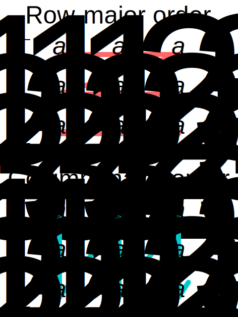

## Array (data structure)
In computer science, an array is a data structure consisting of a collection of elements (values or variables), of same memory size, each identified by at least one array index or key. An array is stored such that the position of each element can be computed from its index tuple by a mathematical formula.[1][2][3] The simplest type of data structure is a linear array, also called one-dimensional array.

For example, an array of ten 32-bit (4-byte) integer variables, with indices 0 through 9, may be stored as ten words at memory addresses 2000, 2004, 2008, ..., 2036, (in hexadecimal: `0x7D0`, `0x7D4`, `0x7D8`, ..., 0x7F4) so that the element with index i has the address 2000 + (i × 4).[4] The memory address of the first element of an array is called first address, foundation address, or base address.

Because the mathematical concept of a matrix can be represented as a two-dimensional grid, two-dimensional arrays are also sometimes called "matrices". In some cases the term "vector" is used in computing to refer to an array, although tuples rather than vectors are the more mathematically correct equivalent. Tables are often implemented in the form of arrays, especially lookup tables; the word "table" is sometimes used as a synonym of array.

Arrays are among the oldest and most important data structures, and are used by almost every program. They are also used to implement many other data structures, such as lists and strings. They effectively exploit the addressing logic of computers. In most modern computers and many external storage devices, the memory is a one-dimensional array of words, whose indices are their addresses. Processors, especially vector processors, are often optimized for array operations.

Arrays are useful mostly because the element indices can be computed at run time. Among other things, this feature allows a single iterative statement to process arbitrarily many elements of an array. For that reason, the elements of an array data structure are required to have the same size and should use the same data representation. The set of valid index tuples and the addresses of the elements (and hence the element addressing formula) are usually,[3][5] but not always,[2] fixed while the array is in use.

The term "array" may also refer to an array data type, a kind of data type provided by most high-level programming languages that consists of a collection of values or variables that can be selected by one or more indices computed at run-time. Array types are often implemented by array structures; however, in some languages they may be implemented by hash tables, linked lists, search trees, or other data structures.

The term is also used, especially in the description of algorithms, to mean associative array or "abstract array", a theoretical computer science model (an abstract data type or ADT) intended to capture the essential properties of arrays.

## History
The first digital computers used machine-language programming to set up and access array structures for data tables, vector and matrix computations, and for many other purposes. John von Neumann wrote the first array-sorting program (merge sort) in 1945, during the building of the first stored-program computer.[6] Array indexing was originally done by self-modifying code, and later using index registers and indirect addressing. Some mainframes designed in the 1960s, such as the Burroughs B5000 and its successors, used memory segmentation to perform index-bounds checking in hardware.[7]

Assembly languages generally have no special support for arrays, other than what the machine itself provides. The earliest high-level programming languages, including FORTRAN (1957), Lisp (1958), COBOL (1960), and ALGOL 60 (1960), had support for multi-dimensional arrays, and so has C (1972). In C++ (1983), class templates exist for multi-dimensional arrays whose dimension is fixed at runtime[3][5] as well as for runtime-flexible arrays.[2]

## Applications
Arrays are used to implement mathematical vectors and matrices, as well as other kinds of rectangular tables. Many databases, small and large, consist of (or include) one-dimensional arrays whose elements are records.

Arrays are used to implement other data structures, such as lists, heaps, hash tables, deques, queues, stacks, strings, and VLists. Array-based implementations of other data structures are frequently simple and space-efficient (implicit data structures), requiring little space overhead, but may have poor space complexity, particularly when modified, compared to tree-based data structures (compare a sorted array to a search tree).

One or more large arrays are sometimes used to emulate in-program dynamic memory allocation, particularly memory pool allocation. Historically, this has sometimes been the only way to allocate "dynamic memory" portably.

Arrays can be used to determine partial or complete control flow in programs, as a compact alternative to (otherwise repetitive) multiple `IF` statements. They are known in this context as control tables and are used in conjunction with a purpose built interpreter whose control flow is altered according to values contained in the array. The array may contain subroutine pointers (or relative subroutine numbers that can be acted upon by SWITCH statements) that direct the path of the execution.

## Element identifier and addressing formulas
When data objects are stored in an array, individual objects are selected by an index that is usually a non-negative scalar integer. Indexes are also called subscripts. An index maps the array value to a stored object.

There are three ways in which the elements of an array can be indexed:

**0 (zero-based indexing)**
    - The first element of the array is indexed by subscript of 0.[8]
**1 (one-based indexing)**
    - The first element of the array is indexed by subscript of 1.
**n (n-based indexing)**
    - The base index of an array can be freely chosen. Usually programming languages allowing n-based indexing also allow negative index values and other scalar data types like enumerations, or characters may be used as an array index.
Using zero based indexing is the design choice of many influential programming languages, including C, Java and Lisp. This leads to simpler implementation where the subscript refers to an offset from the starting position of an array, so the first element has an offset of zero.

Arrays can have multiple dimensions, thus it is not uncommon to access an array using multiple indices. For example, a two-dimensional array `A` with three rows and four columns might provide access to the element at the 2nd row and 4th column by the expression `A[1][3]` in the case of a zero-based indexing system. Thus two indices are used for a two-dimensional array, three for a three-dimensional array, and n for an n-dimensional array.

The number of indices needed to specify an element is called the dimension, dimensionality, or rank of the array.

In standard arrays, each index is restricted to a certain range of consecutive integers (or consecutive values of some enumerated type), and the address of an element is computed by a "linear" formula on the indices.

### One-dimensional arrays
A one-dimensional array (or single dimension array) is a type of linear array. Accessing its elements involves a single subscript which can either represent a row or column index.

As an example consider the C declaration `int anArrayName[10];` which declares a one-dimensional array of ten integers. Here, the array can store ten elements of type `int` . This array has indices starting from zero through nine. For example, the expressions `anArrayName[0]` and `anArrayName[9]` are the first and last elements respectively.

For a vector with linear addressing, the element with index i is located at the address **B + c · i**, where *B* is a fixed base address and *c* *a* fixed constant, sometimes called the address increment or stride.

If the valid element indices begin at 0, the constant B is simply the address of the first element of the array. For this reason, the C programming language specifies that array indices always begin at 0; and many programmers will call that element "zeroth" rather than "first".

However, one can choose the index of the first element by an appropriate choice of the base address **B**. For example, if the array has five elements, indexed 1 through 5, and the base address **B** is replaced by **B + 30c**, then the indices of those same elements will be 31 to 35. If the numbering does not start at 0, the constant B may not be the address of any element.

### Multidimensional arrays
For a multidimensional array, the element with indices i,j would have address **B + c · i + d · j**, where the coefficients c and d are the *row* and *column* address increments, respectively.

More generally, in a k-dimensional array, the address of an element with indices **i1, i2, ..., ik**is

- B + c1 · i1 + c2 · i2 + … + ck · ik.

For example: int a[2][3];

This means that array a has 2 rows and 3 columns, and the array is of integer type. Here we can store 6 elements they will be stored linearly but starting from first row linear then continuing with second row. The above array will be stored as **a11, a12, a13, a21, a22, a23**.

This formula requires only k multiplications and k additions, for any array that can fit in memory. Moreover, if any coefficient is a fixed power of 2, the multiplication can be replaced by bit shifting.

The coefficients ck must be chosen so that every valid index tuple maps to the address of a distinct element.

If the minimum legal value for every index is 0, then B is the address of the element whose indices are all zero. As in the one-dimensional case, the element indices may be changed by changing the base address B. Thus, if a two-dimensional array has rows and columns indexed from 1 to 10 and 1 to 20, respectively, then replacing **B** by **B + c1 − 3c2** will cause them to be renumbered from 0 through 9 and 4 through 23, respectively. Taking advantage of this feature, some languages (like FORTRAN 77) specify that array indices begin at 1, as in mathematical tradition while other languages (like Fortran 90, Pascal and Algol) let the user choose the minimum value for each index.

### Dope vectors
The addressing formula is completely defined by the dimension d, the base address B, and the increments **c1, c2, ..., ck.** It is often useful to pack these parameters into a record called the array's descriptor or stride vector or dope vector.[2][3] The size of each element, and the minimum and maximum values allowed for each index may also be included in the dope vector. The dope vector is a complete handle for the array, and is a convenient way to pass arrays as arguments to procedures. Many useful array slicing operations (such as selecting a sub-array, swapping indices, or reversing the direction of the indices) can be performed very efficiently by manipulating the dope vector.[2]

### Compact layouts
Often the coefficients are chosen so that the elements occupy a contiguous area of memory. However, that is not necessary. Even if arrays are always created with contiguous elements, some array slicing operations may create non-contiguous sub-arrays from them.

There are two systematic compact layouts for a two-dimensional array. For example, consider the matrix

In the row-major order layout (adopted by C for statically declared arrays), the elements in each row are stored in consecutive positions and all of the elements of a row have a lower address than any of the elements of a consecutive row:

`1	2	3	4	5	6	7	8	9
`
In column-major order (traditionally used by Fortran), the elements in each column are consecutive in memory and all of the elements of a column have a lower address than any of the elements of a consecutive column:

`1	4	7	2	5	8	3	6	9`

For arrays with three or more indices, "row major order" puts in consecutive positions any two elements whose index tuples differ only by one in the last index. "Column major order" is analogous with respect to the first index.

In systems which use processor cache or virtual memory, scanning an array is much faster if successive elements are stored in consecutive positions in memory, rather than sparsely scattered. This is known as spatial locality, which is a type of locality of reference. Many algorithms that use multidimensional arrays will scan them in a predictable order. A programmer (or a sophisticated compiler) may use this information to choose between row- or column-major layout for each array. For example, when computing the product A·B of two matrices, it would be best to have A stored in row-major order, and B in column-major order.

### Resizing
Static arrays have a size that is fixed when they are created and consequently do not allow elements to be inserted or removed. However, by allocating a new array and copying the contents of the old array to it, it is possible to effectively implement a dynamic version of an array; see dynamic array. If this operation is done infrequently, insertions at the end of the array require only amortized constant time.

Some array data structures do not reallocate storage, but do store a count of the number of elements of the array in use, called the count or size. This effectively makes the array a dynamic array with a fixed maximum size or capacity; Pascal strings are examples of this.

### Non-linear formulas
More complicated (non-linear) formulas are occasionally used. For a compact two-dimensional triangular array, for instance, the addressing formula is a polynomial of degree 2.

